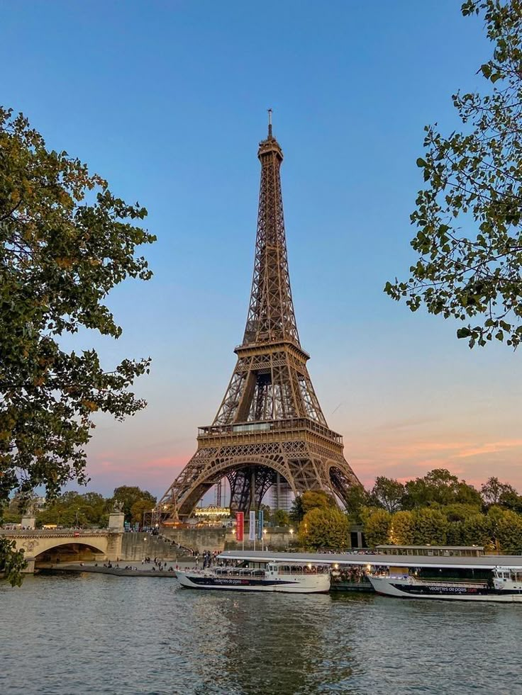

## 📌 Описание проекта
Современный лендинг для туристического агентства с интерактивными элементами. Сайт демонстрирует популярные направления, преимущества компании и отзывы клиентов.

---

## 🌟 Ключевые особенности
- **Интерактивная карта** с маркерами популярных направлений (Leaflet.js)
- **Адаптивный дизайн** с тремя контрольными точками (мобильные, планшеты, десктоп)
- **Плавная прокрутка** к разделам сайта
- **Мобильное меню** с анимацией
- **Стильные hover-эффекты** на карточках и кнопках
- **Декоративные SVG-элементы** для визуального оформления

---

## 🛠 Технологический стек
| Категория       | Технологии                     |
|----------------|-------------------------------|
| **Frontend**   | HTML5, CSS3 (Flexbox/Grid), JavaScript (ES6+) |
| **Библиотеки** | Leaflet.js (для карты) |
| **Шрифты**     | Google Fonts (Montserrat, Playfair Display) |

---

## 🎨 Структура страницы
1. **Hero-секция**:
   - Фоновое изображение с градиентным наложением
   - Анимированная волнообразная разделительная линия (SVG)
   - Кнопка CTA с эффектом свечения

2. **Поиск туров**:
   - Форма с инпутами (направление, дата, бюджет)
   - Стеклянный эффект (glassmorphism)

3. **Популярные направления**:
   - Сетка карточек (CSS Grid)
   - Эффекты при наведении (подъем карточки, увеличение фото)

4. **Преимущества**:
   - Три фичи с иконками
   - Градиентные акценты

5. **Карта**:
   - Интерактивная карта с маркерами
   - Кастомный дизайн

6. **Отзывы**:
   - Горизонтальный скролл-блок
   - Стилизованные цитаты

7. **Футер**:
   - Контактная информация
   - SVG-разделитель

---

## 📱 Адаптивность

```css
/* Контрольные точки */
@media (max-width: 992px) { /* Планшеты */
  .hero h1 { font-size: 3rem; }
}

@media (max-width: 768px) { /* Мобильные (ландшафт) */
  .nav-links { transform: translateX(100%); }
  .menu-toggle { display: block; }
}

@media (max-width: 576px) { /* Мобильные (портрет) */
  .hero h1 { font-size: 2rem; }
  .search-form { flex-direction: column; }
}
```

---

## 🚀 Особенности реализации
```javascript
// Инициализация карты
const map = L.map('travel-map').setView([20, 0], 2);
L.tileLayer('https://{s}.tile.openstreetmap.org/{z}/{x}/{y}.png').addTo(map);

// Добавление маркеров
const destinations = [
    { name: "Париж", coords: [48.8566, 2.3522] },
    { name: "Токио", coords: [35.6762, 139.6503] }
];
destinations.forEach(dest => {
    L.marker(dest.coords)
        .addTo(map)
        .bindPopup(`<b>${dest.name}</b>`);
});
```

```html
<!-- Пример карточки направления -->
<div class="card">
    
    <div class="card-content">
        <h3>Париж</h3>
        <p>От €800</p>
    </div>
</div>
```

```css
/* Эффект при наведении */
.card:hover {
    transform: translateY(-10px);
    box-shadow: 0 15px 40px rgba(0,0,0,0.15);
}
.card:hover img {
    transform: scale(1.05);
}
```

---

## 📌 Рекомендации по улучшению
1. Добавить реальную форму поиска с AJAX-запросами
2. Реализовать слайдер для отзывов (Swiper.js)
3. Добавить анимации при скролле (AOS.js)
4. Оптимизировать изображения (WebP формат)
5. Реализовать темную тему

Проект готов к размещению и может служить отличной визитной карточкой для туристического бизнеса.
